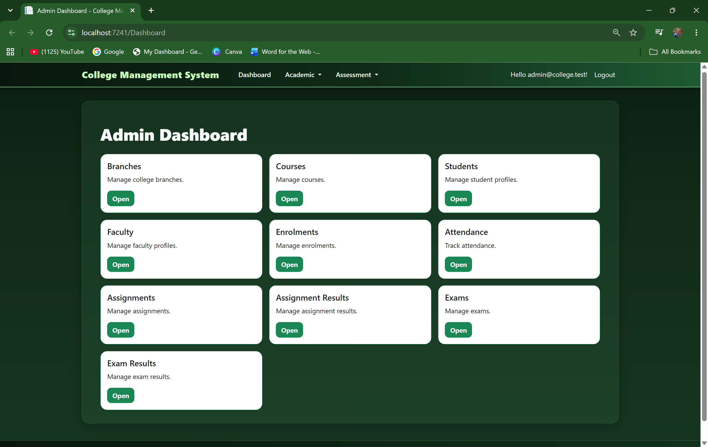
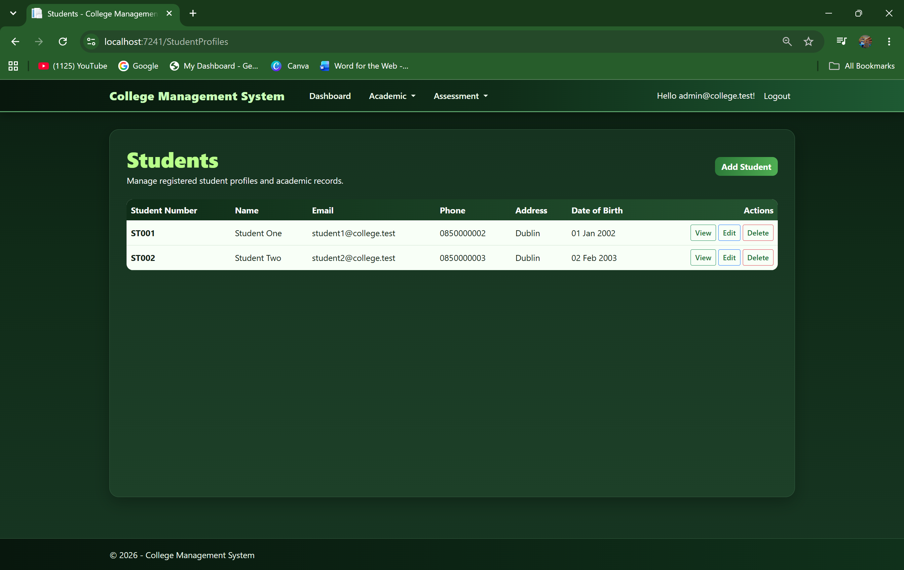
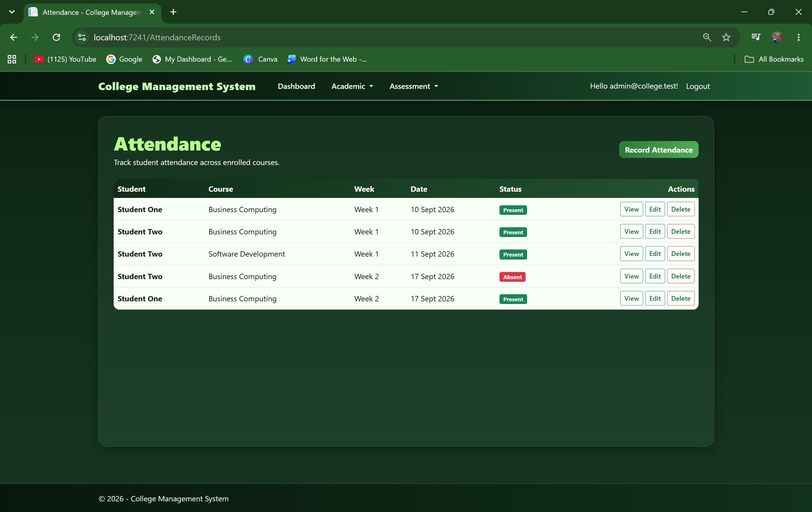

# College Management System

[](https://github.com/sebastian-lopez-cs/college-management-system/actions/workflows/dotnet.yml)

A role-based college management web application built with **ASP.NET Core MVC, .NET 8, Entity Framework Core, SQL Server, and ASP.NET Core Identity**.

The project manages academic operations across Administrator, Faculty, and Student roles, including courses, enrolments, attendance, assignments, exams, and academic results.

## Screenshots

### Administrator Dashboard



### Student Management



### Attendance Management



## Key Features

### Administrator

- Manage college branches and courses
- Manage student and faculty profiles
- Manage course enrolments
- Track attendance
- Manage assignments and assignment results
- Manage exams and exam results
- Access a central administration dashboard

### Faculty

- Access assigned courses
- View students within assigned courses
- Record student attendance
- Manage assignments and results
- Manage exams and exam results

### Student

- Access a dedicated student portal
- View enrolments and course information
- View assignments and academic results
- View released exam results

## Technical Highlights

- ASP.NET Core MVC application using **C# and .NET 8**
- Relational data model implemented with **Entity Framework Core**
- SQL Server database with EF Core migrations
- ASP.NET Core Identity authentication
- Role-based authorization for Administrator, Faculty, and Student users
- Dependency injection and dedicated service classes for business logic
- Eager loading of related entities using EF Core `Include` / `ThenInclude`
- Automated business-logic testing with **xUnit**
- Boundary-value testing for assessment score validation
- Continuous Integration with **GitHub Actions**
- Automated restore, Release build, and test execution on pull requests

## Tech Stack

- C#
- .NET 8
- ASP.NET Core MVC
- Entity Framework Core
- SQL Server
- ASP.NET Core Identity
- Razor Views
- Bootstrap
- xUnit
- Git
- GitHub Actions

## Architecture

The solution is separated into three projects:

```text
CollegeManagement.Domain
    Core domain entities and business models

CollegeManagement.Web
    ASP.NET Core MVC application
    Controllers
    Razor views
    Services
    Authentication
    Entity Framework Core data access

CollegeManagement.Tests
    Automated xUnit tests
```

The application uses dependency injection and dedicated services for business rules including:

- enrolment validation
- faculty course access
- exam result visibility
- score validation

## Database Design

The relational model includes:

- Branches
- Courses
- Student Profiles
- Faculty Profiles
- Faculty Course Assignments
- Course Enrolments
- Attendance Records
- Assignments
- Assignment Results
- Exams
- Exam Results

Entity relationships and integrity rules are configured using Entity Framework Core.

Examples include:

- unique student/course enrolments
- faculty/course assignments
- one-to-many course relationships
- controlled delete behaviour
- decimal precision for academic scores

## Automated Testing

The project currently contains **12 automated xUnit tests** covering business rules such as:

- duplicate enrolment prevention
- faculty course access
- result visibility
- score validation
- lower and upper score boundaries

The test suite is executed locally and automatically through GitHub Actions.

## Continuous Integration

The GitHub Actions pipeline automatically:

1. Checks out the repository
2. Installs .NET 8
3. Restores NuGet dependencies
4. Builds the solution in Release mode
5. Runs the automated test suite

A failing build or failing test causes the CI pipeline to fail.

## Running Locally

### Requirements

- Visual Studio 2022 or later
- .NET 8 SDK
- SQL Server LocalDB

### Setup

1. Clone the repository.
2. Open `CollegeManagementSystem.sln`.
3. Restore NuGet packages.
4. Open the Package Manager Console.
5. Run:

```powershell
Update-Database -Project CollegeManagement.Web -StartupProject CollegeManagement.Web
```

6. Set `CollegeManagement.Web` as the startup project.
7. Run the application.

## Demo Accounts

The development seed data creates demonstration accounts for each role.

```text
Administrator
admin@college.test

Faculty
faculty@college.test

Student
student1@college.test
```

The seeded accounts are intended only for local development and portfolio demonstration.

## Project Context

This project originated during my Computer Science studies and was subsequently refactored and expanded into a portfolio-ready ASP.NET Core application.

The refactoring included:

- removing obsolete legacy modules
- reorganising the solution into clearer Domain, Web, and Test projects
- rebuilding the Entity Framework database migrations
- improving role-based navigation
- improving management interfaces
- strengthening automated testing
- adding a working CI pipeline

The objective is to demonstrate practical understanding of **C#, .NET, object-oriented programming, relational databases, authentication, automated testing, Git workflows, and CI/CD fundamentals**.

## Future Improvements

- REST API endpoints
- advanced search, filtering and pagination
- reporting and analytics
- containerisation with Docker
- cloud deployment

## Author

**Sebastian Lopez**

Computer Science Student — Dublin, Ireland